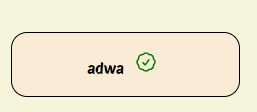

# The only shopping list you'll ever need

Need something to keep track of your cart items while you shop? **Look no further**.

I built this app to practice using the state hook. I started very basic with just displaying the cart items and as I became more comfortable, I made it a bit more *complex* by adding logic to buttons that change the propery of the cart item object propery which indicate if the item has been checked or not.

   

As you can see, the button that is not clicked shows as a default check and a done property of false.

However, when you click the button, 

   

The cart item object property changes to true.

### how do I run the app?

* Simply copy to repo to your code editor, open the terminal and run *npm install* which will install all the necessary packages to your machine.

* Then, run *npm run dev* which will prompt you to control click the local link.

* Once you control click the link, you should see a page like this,

* Then type what you need to buy and click the cart emoji.

### There you have it, the only shopping list you'll ever need :happy:

